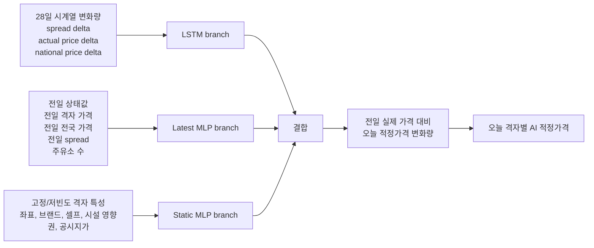

# K-Fuel Fair Price

[사이트 바로가기](https://brightash.github.io/k-fuel-fair-price/)

## 서론

이 프로젝트는 국제 유가가 급등했을 때 국내 기름값이 어느 정도의 시차와 폭으로 반응하는 것이 적절한지 확인하기 위해 시작했다. 중동 지역 전쟁 리스크와 이란-미국 충돌 가능성으로 국제 석유제품 가격이 급등했을 때, 국내 소비자가격도 거의 즉시 오른 것처럼 보였다. 하지만 국제 제품가격이 국내 주유소 가격에 반영되기까지는 환율, 세금, 정유사 공급가격, 유통 과정, 재고와 같은 시차가 존재한다.

따라서 핵심 질문은 단순히 “오늘 어디가 싼가?”가 아니라 “국제가격, 환율, 세금, 정책, 반영 시차를 고려했을 때 오늘 가격이 적정한가?”이다.

## 프로젝트 개요

K-Fuel Fair Price는 국내 주유소 가격의 적정성을 분석하고, 이를 국민과 공공기관, 주유소가 함께 이해할 수 있는 형태로 보여주는 적정유가 판단 프로젝트다.

목표는 세 가지다.

| 대상 | 제공하려는 가치 |
|---|---|
| 국민 | 단순 최저가 검색이 아니라 현재 가격이 국제유가와 정책을 고려해 적정한지 이해 |
| 공공기관 | 적정 가격대를 벗어나는 지역과 격자를 상시 모니터링 |
| 주유소 | 현재 시장 상황에서 어느 정도 가격대가 합리적인지 참고 |

최종 결과는 전국 평균 하나로 끝나지 않는다. 전국 단위의 정책 적용 적정가격을 먼저 만들고, 이를 500m 격자 단위로 확장해 지역별 가격 차이를 반영한다. 웹 페이지에서는 오늘의 실제 가격, AI 적정가격, 적정가격대, 실제-적정 차이, 가격 추이와 데이터 현황을 확인할 수 있다.

## 전체 판단 구조


핵심은 국제가격을 국내 가격에 바로 붙이지 않는 것이다. 먼저 국내 가격을 가장 잘 설명하는 국제 benchmark를 찾고, 그 benchmark가 국내 가격에 반영되는 시차를 추정한 뒤, 정책 효과를 반영해 적정가격대를 만든다.

## 데이터 범위

분석은 2008년 4월부터 2026년 6월까지의 일별 데이터를 기준으로 구성했다.

| 데이터 묶음 | 사용 내용 |
|---|---|
| 국제 가격 | 두바이, 브렌트, WTI, 휘발유 92RON, 경유 0.001 등 |
| 환율 | 국제가격을 원화/리터 기준으로 변환 |
| 국내 가격 | 전국 평균 주유소 가격, 브랜드별 가격, 주유소별 가격 |
| 세금과 정책 | 유류세, 유류세 인하율, 정유사 최고가격제 |
| 공간 데이터 | 주유소 위치, 브랜드/셀프 여부, 저유소/대리점/공장, 공시지가, 500m land grid |

최종 일별 통합 분석 데이터는 6,630일, 44개 컬럼으로 구성되며, AI 격자 패널은 63,800,291행과 12,338개 격자를 포함한다.

## 개발 과정과 핵심 결과

### 1. 원천 데이터 정리

원유, 국제 석유제품, 환율, 국내 소비자가격, 세금, 정유사 공급가격을 날짜 기준으로 통합했다. 서로 다른 주기와 컬럼명을 가진 데이터를 하나의 일별 분석 테이블로 맞추는 단계다.

이 단계의 의미는 모델을 바로 만드는 것이 아니라, 이후 모든 판단이 같은 날짜 축에서 비교되도록 기준 데이터를 만드는 것이다.

### 2. 국제 benchmark 선택

국내 휘발유와 경유 가격을 설명하는 국제 기준을 선택했다. 원유 가격 자체보다 국내 제품과 직접 대응되는 국제 석유제품 가격이 더 적합했다.

| 유종 | 선택 benchmark | OOS RMSE | OOS MAE | 해석 |
|---|---|---:|---:|---|
| 휘발유 | 휘발유 92RON | 16.360원/L | 12.587원/L | 원유 후보보다 설명력이 높음 |
| 경유 | 경유 0.001 | 18.223원/L | 13.892원/L | 저유황 경유 제품가격이 가장 적합 |

즉 “국제유가”를 볼 때 원유 가격만 보는 것보다, 휘발유와 경유 각각의 국제 제품가격을 보는 것이 국내 가격 적정성 판단에 더 적합하다.

### 3. 국내 반영 시차 분석

국제 제품가격 변화가 국내 소비자가격과 정유사 공급가격에 반영되는 시차를 추정했다. 가격 수준이 아니라 변화율을 사용해 시차 구조를 계산했고, 정책 충격 기간은 정상적인 시장 반응을 왜곡할 수 있어 제외했다.

| 분석 대상 | 평균 반영 시차 | 권장 시차 | 해석 |
|---|---:|---:|---|
| 휘발유 소비자가격 | 20.267일 | 약 20일 | 약 3주에 걸쳐 반영 |
| 경유 소비자가격 | 23.048일 | 약 23일 | 휘발유보다 조금 더 늦게 반영 |
| 휘발유 정유사 세전가격 | 8.118주 | 약 56일 | 정유사 단계 진단에 사용 |
| 경유 정유사 세전가격 | 6.294주 | 약 42일 | 정유사 단계 진단에 사용 |

이 결과는 “국제가격이 올랐으니 국내 가격도 즉시 오르는 것이 당연하다”는 해석을 그대로 받아들이기 어렵다는 근거가 된다. 국내 가격에는 유의미한 반영 시차가 존재한다.

### 4. 전국 적정가격대 산정

국제제품가격과 반영 시차를 사용해 정책 미반영 전국 적정가격대를 계산했다. 최종 소비자가격 모델은 정유사 가격을 직접 넣지 않고, 국제제품가격의 반영 구조와 시간 효과를 사용한 direct retail Huber 모델로 만들었다.

| 유종 | 실제가격 평균 | 정책 미반영 적정가격 평균 | gap 평균 |
|---|---:|---:|---:|
| 휘발유 | 1,664.020원/L | 1,726.984원/L | -60.290원/L |
| 경유 | 1,505.244원/L | 1,556.227원/L | -103.462원/L |

`gap = 실제가격 - 적정가격`이다. 평균 gap이 음수인 것은 전체 기간 평균으로 실제가격이 정책 미반영 적정가격보다 낮은 날이 많았다는 뜻이다. 다만 이 결과에는 유류세 인하 효과가 아직 반영되지 않았기 때문에, 정책 기간에는 추가 보정이 필요하다.

### 5. 유류세 정책 적용

유류세 인하 정책은 소비자가격을 직접 낮추는 효과가 있으므로, 적정가격과 적정가격대도 같은 방향으로 낮춰야 한다. 정책을 반영하지 않으면 유류세 인하로 낮아진 가격을 “과도하게 저렴한 가격”으로 잘못 해석할 수 있다.

| 유종 | 정책 미반영 적정가격 평균 | 정책 적용 적정가격 평균 | 평균 정책효과 |
|---|---:|---:|---:|
| 휘발유 | 1,726.984원/L | 1,675.475원/L | 51.509원/L |
| 경유 | 1,556.227원/L | 1,494.740원/L | 61.487원/L |

정책 적용 전후 판정도 크게 달라졌다.

| 유종 | 기준 | 판정 가능일 | 적정 | 상향 이탈 | 하향 이탈 |
|---|---|---:|---:|---:|---:|
| 휘발유 | 미정책 | 5,979일 | 2,500일 | 789일 | 2,690일 |
| 휘발유 | 정책 적용 | 5,979일 | 3,111일 | 1,170일 | 1,698일 |
| 경유 | 미정책 | 4,567일 | 1,670일 | 507일 | 2,390일 |
| 경유 | 정책 적용 | 4,567일 | 1,853일 | 724일 | 1,990일 |

유류세 정책 기간만 보면 휘발유의 적정일은 4일에서 615일로, 경유의 적정일은 9일에서 192일로 증가했다. 정책 효과를 반영해야 가격 판정이 현실과 맞아진다.

### 6. 격자별 target dataset 생성

전국 적정가격만으로는 지역별 가격 차이를 볼 수 없다. 따라서 전국 정책 적용 적정가격을 anchor로 두고, 각 500m 격자가 전국 평균보다 비싼지 싼지를 나타내는 실제 가격 spread를 결합했다.

```text
격자 실제 spread = 격자 실제 가격 - grid 기준 전국 실제 가격
격자 적정가격 target = 전국 정책 적용 적정가격 + 격자 실제 spread
```

이 방식은 전국 레벨은 data-analysis의 적정가격을 따르고, 공간적 상대가격은 실제 격자 가격 구조를 유지한다.

| 항목 | 값 |
|---|---:|
| 전체 격자 패널 | 63,800,291행 |
| unique grid | 12,338개 |
| 휘발유 target 행 | 59,613,708행 |
| 경유 target 행 | 45,487,926행 |
| 휘발유 target 가중평균 | 1,675.984원/L |
| 경유 target 가중평균 | 1,487.338원/L |

### 7. AI 모델 학습

AI 모델은 “오늘 전국 평균 가격”을 입력으로 쓰지 않는다. 사용자가 알고 싶은 것은 오늘의 적정가격이므로, 모델은 전날까지의 28일 시계열과 격자 특성만으로 다음 날 격자별 적정가격을 예측하도록 만들었다.



학습 데이터 구성은 다음 원칙을 따랐다.

| 항목 | 기준 |
|---|---|
| 입력 시계열 | 기준일 전 28일 |
| 예측 대상 | 오늘 격자별 적정가격 |
| target | 오늘 격자 적정가격과 전일 격자 실제가격의 차이 |
| train/validation | 2026년 이전 데이터 |
| test | 2026-01-01 이후 데이터 |
| 정책 기간 처리 | train/validation에서는 target date와 29일 history 안의 정책 기간을 완전히 제외 |
| split | 시간 순서 기준 약 7:3, train과 validation 사이 7일 gap |
| 샘플링 | 대용량 데이터에서 시간/공간 hash 기반 20% 표본 사용 |

검증 결과는 다음과 같다.

| 유종 | best epoch | validation AI WMAE | validation 전일가격 baseline WMAE | 2026 test WMAE |
|---|---:|---:|---:|---:|
| 휘발유 | 4 | 19.318원/L | 15.211원/L | 231.790원/L |
| 경유 | 4 | 19.422원/L | 14.807원/L | 518.133원/L |

validation에서는 전일 가격 유지 baseline이 매우 강하게 작동했다. 특히 2017~2021년 구간은 가격 흐름이 비교적 연속적이어서 단순 baseline보다 AI가 낮은 성능을 보였다. 반면 2026 test에서는 3월 이후 전국 적정가격 target이 급격히 상승하면서 오차가 크게 커졌다.

중요한 해석은 다음과 같다. 모델 출력은 실제 시장 가격 흐름 근처에서 안정적으로 움직이지만, data-analysis가 만든 정책 적용 적정가격 target이 2026년 정책/국제가격 충격으로 급격히 상승하는 구간에서는 그 레벨을 즉시 따라가지 못한다. 따라서 이 모델은 최종 산출물로 사용하되, 급격한 정책/국제가격 충격 구간에서는 한계를 함께 표시해야 한다.

### 8. 웹 서비스와 자동화

웹 페이지는 대용량 학습 parquet를 직접 읽지 않는다. AI 산출물을 웹 표시용 CSV와 JSON으로 줄여서 사용한다.

| 화면 | 보여주는 내용 |
|---|---|
| 메인 지도 | 시도별 현재가, AI 적정가격, 실제-적정 차이 |
| 가격 추이 | 실제가격, 적정가격, 적정가격대의 기간별 변화 |
| 데이터 다운로드 | 웹에서 사용하는 입력/출력 요약 데이터 |
| 데이터 현황 | 당일 입력 데이터와 AI 출력의 지역별 분포 |
| 정책 카드 | 진행 중인 유류세 인하, 최고가격제 등 정책 정보 |

자동화 흐름은 최신 주유소 가격 파일이 들어오면 최근 28일 입력 상태를 갱신하고, 다음 날 적정가격을 예측해 웹 데이터로 변환하는 구조다.


다만 원천 주유소 가격 파일 자체가 갱신되지 않으면 모델도 새로운 날짜를 정직하게 예측할 수 없다. 현재 자동화는 입력 파일이 최신으로 들어온다는 전제에서 웹 산출물을 갱신한다.

## 최종 산출물

| 영역 | 대표 산출물 | 의미 |
|---|---|---|
| 전국 적정가격 | `data-analysis/05_policy_application/outputs` | 정책 적용 전국 적정가격과 판정 |
| 격자 target | `ai-model/03_target_dataset_build/outputs/grid_target.parquet` | AI 학습용 격자별 적정가격 target |
| AI 모델 | `ai-model/04_prediction_model_training/outputs/*/model` | 휘발유/경유 LSTM 모델 |
| 웹 운영 데이터 | `ai-model/06_web_operational_dataset_build/outputs/web` | Git에 올릴 수 있는 웹 표시용 요약 데이터 |
| 웹 페이지 | `page/public/data/latest` | 지도, 카드, 차트가 읽는 최종 JSON |

## 핵심 결론

1. 국내 가격 적정성 판단에는 원유 가격보다 휘발유 92RON, 경유 0.001 같은 국제 석유제품 benchmark가 더 적합했다.
2. 국제 제품가격은 국내 소비자가격에 즉시 반영되지 않고, 휘발유 약 20일, 경유 약 23일의 평균 반영 시차를 보였다.
3. 유류세 인하 기간에는 정책효과를 적정가격대에도 반영해야 판정이 현실적으로 해석된다.
4. 전국 적정가격은 격자별 spread와 결합해 500m 단위 target으로 확장할 수 있었다.
5. AI 모델은 전날까지의 정보만으로 다음 날 격자별 적정가격을 예측하는 서비스 목적에는 맞지만, 2026년처럼 전국 적정가격 레벨이 급격히 바뀌는 구간에서는 오차가 커진다.

## 한계와 개선 방향

| 한계 | 현재 상태 | 개선 방향 |
|---|---|---|
| 최고가격제 반영 | 최고가격제는 정유사 단계 감사로만 반영했고, 소비자가격 target에는 직접 적용하지 않았다. 이 때문에 2026년 test 오차가 커지는 원인이 된다. | 최고가격제가 소비자가격으로 전달되는 구조를 별도 모델링하거나, 정책 상한이 retail target에 미치는 효과를 추정 |
| 전국 레벨 급변 | AI 모델은 target date의 전국 적정가격 anchor를 입력으로 쓰지 않는다. 그래서 국제가격이나 정책으로 전국 적정가격이 급변하면 늦게 따라간다. | 전국 적정가격 예측 모델과 격자 spread 모델을 분리하거나, 외생 충격 feature를 추가 |
| validation baseline | 안정적인 가격 구간에서는 전일 가격 유지 baseline이 매우 강하다. | baseline 대비 개선이 필요한 구간을 분리하고, 변화 구간에 초점을 둔 loss와 sampling 재설계 |
| 격자 단위 한계 | 현재 모니터링 단위는 500m 격자이며, 개별 주유소별 적정가격을 직접 판정하지 않는다. | 주유소 단위 후처리 모델 또는 격자 결과를 개별 주유소로 배분하는 layer 추가 |
| 입력 feature 제한 | 도로 접근성, 교통량, 임대료, 경쟁 강도, 실시간 재고 등 가격과 관련 있는 변수가 충분히 들어가지 않았다. | 도로망, 인구/교통, 상권, 임대료, 물류거리 등 공간 feature 추가 |
| 원천 데이터 자동 수집 | 웹 자동화는 최신 입력 파일이 들어온다는 전제에서 동작한다. | 원천 데이터 수집부터 검증, 추론, 배포까지 완전 자동화 |
| 정책 해석 | 정책 효과는 단순 가격 shift로 반영했다. 실제 시장에서는 정책 반영률, 지역별 전가율, 재고 효과가 다를 수 있다. | 정책별 전가율을 추정하고 지역별 반영 차이를 모델링 |

이 프로젝트는 완성된 규제 가격표라기보다, 국제가격과 정책을 고려해 “지금 가격이 적정 범위에 있는지”를 설명하는 모니터링 체계의 PoC다. 향후 더 세분화된 데이터와 정책 전달 구조를 반영하면 공공 모니터링, 소비자 정보 제공, 주유소 가격 조정 참고자료로 더 신뢰성 있게 확장할 수 있다.

## 폴더 구조

| 폴더 | 역할 |
|---|---|
| `data-analysis/` | benchmark, 반영 시차, 전국 적정가격, 정책 적용 분석 |
| `ai-model/` | 공간 feature, 격자 target, AI 모델 학습, 웹 운영 데이터 생성 |
| `page/` | 공개 웹 대시보드와 페이지용 JSON |
| `automation/` | 데이터 갱신과 웹 배포 자동화 아이디어 |

